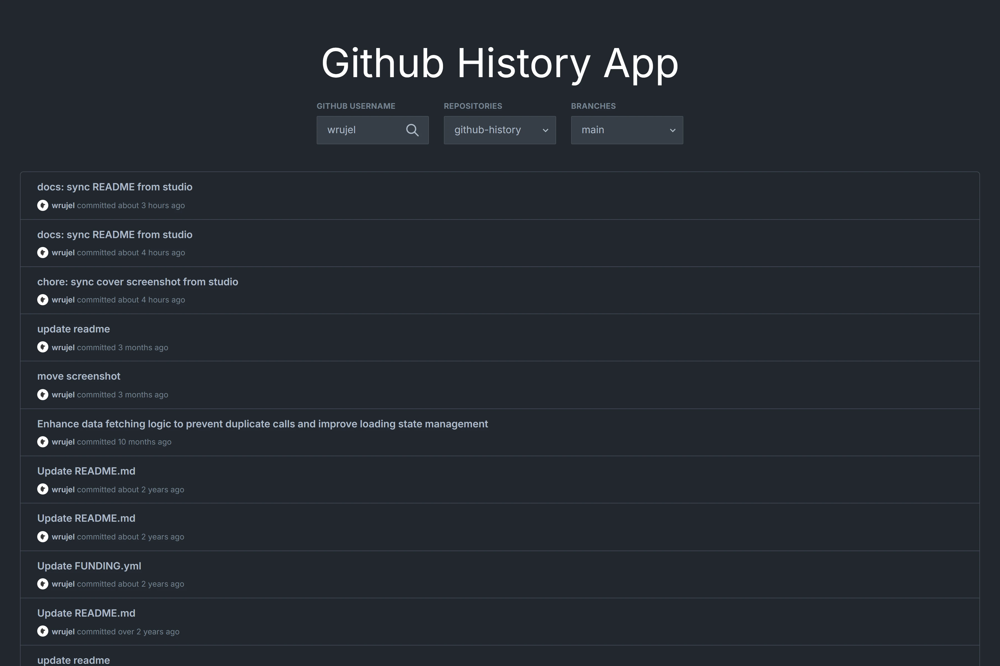

<div align='center'>

  [![demo][demo]][demo-link]
  [![status][status]][status-link]
  [![deploy][deploy]](/)
  [![test][tests]][tests-link]

</div>

<div align='center'>
  <a href='/'>
    
  </a>
</div>

<div align='center'>
  <h1>Github History App with Next.js and NestJS</h1>
</div>

<div align='center'>

  [![Next.js][nextjs]][nextjs-link]
  [![TypeScript][typescript]][typescript-link]
  [![Tailwind CSS][tailwindcss]][tailwindcss-link]
  [![React][react]][react-link]
  [![NestJS][nestjs]][nestjs-link]
  [![Swagger][swagger]][swagger-link]
  [![Axios][axios]][axios-link]
  [![Jest][jest]][jest-link]
  [![Date-fns][date-fns]][date-fns-link]
  [![React Hot Toast][react-hot-toast]][react-hot-toast-link]
  [![Vercel][vercel]][vercel-link]

</div>

<div align='center'>
  A web app to browse the commit history of any GitHub user's repositories. Built with Next.js on the frontend and NestJS on the backend, it fetches data from the GitHub API and displays commits with author info, messages, and relative timestamps.

  [Demo][demo-link] · [Report issue](/issues) · [Suggest something](/issues)
</div>

## Table of Contents

- [Table of Contents](#table-of-contents)
- [Features](#features)
- [Tech Stack](#tech-stack)
- [Getting Started](#getting-started)
  - [Prerequisites](#prerequisites)
  - [Installation](#installation)
  - [Running locally](#running-locally)
  - [Build](#build)
- [Environment Variables](#environment-variables)
- [Project Structure](#project-structure)
- [Demo](#demo)
- [API Reference](#api-reference)
- [Contributing](#contributing)
- [License](#license)

## Features

- [x] Browse repositories for any GitHub user
- [x] View branches for a selected repository
- [x] View commit history with author, message, and relative date
- [x] Search GitHub users with debounced input
- [x] Dual fetch mode: client-side (GitHub API) or server-side (NestJS backend)
- [x] Swagger API documentation at `/api/docs`
- [x] Responsive design with Tailwind CSS
- [x] Toast notifications for errors and status updates
- [x] Relative time display with date-fns
- [x] Type-safe codebase with TypeScript
- [x] Unit and e2e testing with Jest

## Tech Stack

- [Next.js 12](https://nextjs.org/)
- [React 18](https://react.dev/)
- [TypeScript](https://www.typescriptlang.org/)
- [Tailwind CSS](https://tailwindcss.com/)
- [NestJS](https://nestjs.com/)
- [Axios](https://axios-http.com/)
- [Swagger](https://swagger.io/)
- [Jest](https://jestjs.io/)
- [date-fns](https://date-fns.org/)
- [react-hot-toast](https://react-hot-toast.com/)
- [just-debounce-it](https://www.npmjs.com/package/just-debounce-it)
- [Vercel](https://vercel.com/)

## Getting Started

### Prerequisites

- Node.js 16+
- npm

### Installation

```bash
git clone https://github.com/wrujel/github-history.git
cd github-history
```

Install dependencies for both frontend and backend:

```bash
cd frontend
npm install
cd ../backend
npm install
```

### Running locally

Start the backend server:

```bash
cd backend
npm run start:dev
```

Start the frontend dev server:

```bash
cd frontend
npm run dev
```

Open [http://localhost:3000](http://localhost:3000) with your browser to see the result.
The backend API runs on [http://localhost:8080](http://localhost:8080).

### Build

Frontend:

```bash
cd frontend
npm run build
```

Backend:

```bash
cd backend
npm run build
```

## Environment Variables

To run this project, you will need to add the following environment variables to your `.env` file.

| Variable                 | Description                                                                                       | Required |
| :----------------------- | :------------------------------------------------------------------------------------------------ | :------: |
| `PORT`                   | Backend server port (default: 8080)                                                               |    No    |
| `NEXT_PUBLIC_SERVER_URL` | URL of the NestJS backend server (default: `http://localhost:8080`)                               |    No    |
| `NEXT_PUBLIC_FETCH_MODE` | Fetch mode: `client` to call GitHub API directly, `server` to use the backend (default: `client`) |    No    |

## Project Structure

```
/
├── backend/
│   ├── src/
│   │   ├── models/
│   │   │   └── api.models.ts
│   │   ├── app.controller.ts
│   │   ├── app.module.ts
│   │   ├── app.service.ts
│   │   └── main.ts
│   ├── test/
│   ├── nest-cli.json
│   ├── package.json
│   └── tsconfig.json
├── frontend/
│   ├── components/
│   │   ├── inputs/
│   │   └── ...
│   ├── hooks/
│   ├── pages/
│   │   └── index.tsx
│   ├── services/
│   ├── styles/
│   ├── utils/
│   ├── next.config.js
│   ├── package.json
│   ├── tailwind.config.js
│   └── tsconfig.json
├── images/
│   └── screenshot.png
└── LICENSE
```

## Demo

You can check out the demo:

[![Demo][demo]][demo-link]

## API Reference

The backend exposes a REST API with Swagger documentation available at `/api/docs`.

| Method | Endpoint        | Description                                   | Auth Required |
| :----- | :-------------- | :-------------------------------------------- | :-----------: |
| `GET`  | `/`             | Server status and version info                |      No       |
| `POST` | `/api/user`     | Get GitHub user profile data                  |      No       |
| `POST` | `/api/repos`    | Get repositories for a GitHub user            |      No       |
| `POST` | `/api/branches` | Get branches for a repository                 |      No       |
| `POST` | `/api/commits`  | Get commits for a branch                      |      No       |
| `POST` | `/api/data`     | Get all data (user, repos, branches, commits) |      No       |

## Contributing

Contributions are welcome! If you have suggestions or find bugs, please open an issue or submit a pull request.

1. Fork the repository
2. Create your feature branch (`git checkout -b feature/amazing-feature`)
3. Commit your changes (`git commit -m 'Add some amazing feature'`)
4. Push to the branch (`git push origin feature/amazing-feature`)
5. Open a Pull Request

## License

This project is licensed under the [MIT License](LICENSE).

---

<!-- Badges -->
[nextjs]: https://img.shields.io/badge/Next.js-black?style=for-the-badge&logo=next.js
[typescript]: https://img.shields.io/badge/Typescript-007ACC?style=for-the-badge&logo=typescript&logoColor=white&color=blue
[tailwindcss]: https://img.shields.io/badge/Tailwind%20CSS-38B2AC?style=for-the-badge&logo=tailwind-css&logoColor=white
[react]: https://img.shields.io/badge/React-20232A?style=for-the-badge&logo=react&logoColor=61DAFB
[nestjs]: https://img.shields.io/badge/NestJS-E0234E?style=for-the-badge&logo=nestjs&logoColor=white
[swagger]: https://img.shields.io/badge/Swagger-85EA2D?style=for-the-badge&logo=swagger&logoColor=black
[axios]: https://img.shields.io/badge/Axios-671ddf?style=for-the-badge&logo=axios&logoColor=white
[jest]: https://img.shields.io/badge/Jest-C21325?style=for-the-badge&logo=jest&logoColor=white
[date-fns]: https://img.shields.io/badge/Date--fns-F7841B?style=for-the-badge&logo=date-fns&logoColor=white
[react-hot-toast]: https://img.shields.io/badge/React--Hot--Toast-2A2A2A?style=for-the-badge&logo=npm&logoColor=white
[vercel]: https://img.shields.io/badge/Vercel-000000?style=for-the-badge&logo=vercel&logoColor=white

<!-- Badge links -->
[nextjs-link]: https://nextjs.org/
[typescript-link]: https://www.typescriptlang.org/
[tailwindcss-link]: https://tailwindcss.com/
[react-link]: https://react.dev/
[nestjs-link]: https://nestjs.com/
[swagger-link]: https://swagger.io/
[axios-link]: https://axios-http.com/
[jest-link]: https://jestjs.io/
[date-fns-link]: https://date-fns.org/
[react-hot-toast-link]: https://react-hot-toast.com/
[vercel-link]: https://vercel.com/

<!-- Status badges -->
[demo]: https://img.shields.io/badge/🚀%20Live%20Demo-Visit-9cf?style=for-the-badge
[demo-link]: https://github-history.vercel.app/
[status]: https://img.shields.io/endpoint?url=https%3A%2F%2Fraw.githubusercontent.com%2Fwrujel%2Fmonitor-repos%2Fmain%2Fdata%2Fgithub-history.json&style=for-the-badge
[status-link]: https://github.com/wrujel/monitor-repos
[deploy]: https://img.shields.io/github/deployments/wrujel/github-history/production?style=for-the-badge&label=Deploy
[tests]: https://img.shields.io/endpoint?url=https%3A%2F%2Fraw.githubusercontent.com%2Fwrujel%2Fmonitor-tests%2Fmain%2Fdata%2Fgithub-history.json&style=for-the-badge
[tests-link]: https://github.com/wrujel/monitor-tests
